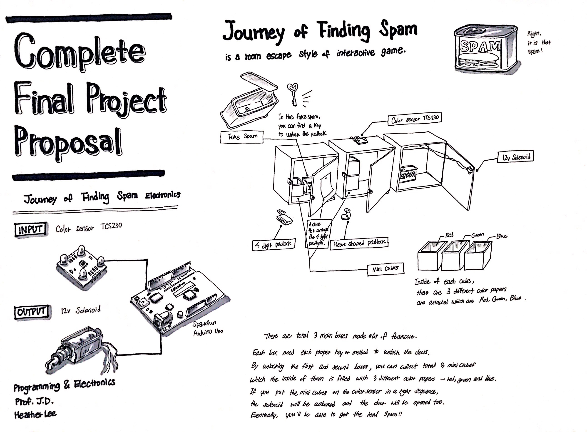
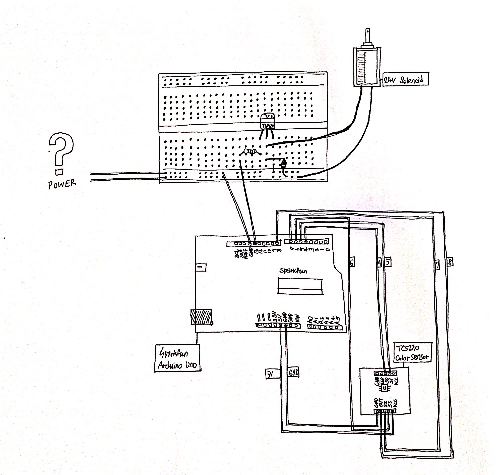

# Journey of Finding Spam

Project Journey of Finding Spam is a room escape style of interactive game.

## Summary

  

 
For input, I used a color sensor TCS230 and a solenoid for output. To connect them together, I used Arduino Uno from Sparkfun. As it is shown on the picture, There are total 3 main boxes made out of foamcore. Each box needs each proper key or method to unlock the doors. By unlocking the first and second boxes, you can collect total 3 mini cubes which the inside of them is filled with 3 different color papers - red, green and blue. If you put the mini cubes on the color sensor in a right sequence, the solenoid will be unlocked and the door will be opened too. Eventually, you'll be able to get the real spam.

 
The 24v solenoid -It was actually 24v solenoid! Not 12v as it is shown on the picture- was the only solenoid in the Hybrid Lab. I couldn't find another solenoid that requires lower power. In other words, it was challenging to me to give proper amount of power to the solenoid. I couldn't figure out how to connect the solenoid with the color sensor. 

## Component Parts

From what pieces did you build your project?

Include what types of inputs/outputs/data it will use, and a block diagram showing how all those pieces are connected.

  

 
For input, I used a color sensor TCS230 and a solenoid for output. To connect them together, I used Arduino Uno from Sparkfun. As you can see on the picture, to control the 24v power (It was actually 24v solenoid!), I also used TIP120 transistor, 1k ohm resistor, and diode additionally. The color sensor worked well to detect each red, green, and blue colors' frequencies but it was hard to find proper amount of power to fulfill 24v. Code for this project was also well prepared. I planned to use if statement to detect red, green, blue color frequencies in the sequence - RGB - to give a knowledge what is the primary color in light. Eventually, the solenoid will be locked and unlocked as it is HIGH or LOW when the if statement becomes true.

## Challenges

I didn't know that little solenoid needs that much of amount of power - 24v. It was my fault that didn't do research a lot about all the electronics how they are connected each other. Eventually, I could approach how to connect the solenoid and the color sensor each other, but couldn't figure out what other output I could use or where to find to supply that much of power for the solenoid.

## Timeline

What did you do in each of the past five weeks

- Week 1: Thought about final project.

- Week 2: Finished final project proposal and ordered electronic parts which are Adafruit color sensor and magnetic doorlock. 

- Week 3: Electronic parts delivery was delayed, and started making a diagram. 

- Week 4: Changed the plan to use TCS230 color sensor and 24v solenoid and ordered the sensor again. 

- Week 5: Presented!

## Completed Work

The link to view the video of final project: 

https://www.dropbox.com/sh/z78jsofmnqo9i56/AACNtv7Dw6Blin-_NXiC7DKXa?dl=0&preview=IMG_1426.m4v 

## References and links

How to use TCS230 color sensor: 

https://howtomechatronics.com/tutorials/arduino/arduino-color-sensing-tutorial-tcs230-tcs3200-color-sensor/ 

How to control 24v solenoid with Arduino

http://www.instructables.com/id/Controlling-solenoids-with-arduino/

